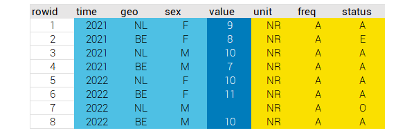

<!-- README.md is generated from README.Rmd. Please edit that file -->

# The dataset R Package <a href='https://dataset.dataobservatory.eu/'></a>

<!-- badges: start -->

[](https://lifecycle.r-lib.org/articles/stages.html#experimental)
[](https://cran.r-project.org/package=dataset)
[](https://cran.r-project.org/package=dataset)
[](https://github.com/ropensci/software-review/issues/553)
[](https://zenodo.org/record/6950435#.YukDAXZBzIU)
[](https://github.com/dataobservatory-eu/dataset)
[](https://dataobservatory.eu/)
[](https://twitter.com/intent/follow?screen_name=ropengov)
[](https://app.codecov.io/gh/dataobservatory-eu/dataset?branch=master)
[](https://github.com/dataobservatory-eu/dataset/actions?query=workflow%3Apkgcheck)
[](https://ci.appveyor.com/project/dataobservatory-eu/dataset)

<!-- badges: end -->

The primary aim of dataset is create well-referenced, well-described,
interoperable datasets from data.frames, tibbles or data.tables that
translate well into the W3C DataSet definition within the [Data Cube
Vocabulary](https://www.w3.org/TR/vocab-data-cube/) in a reproducible
manner. The data cube model in itself is is originated in the
[Statistical Data and Metadata eXchange](https://sdmx.org/), and it is
almost fully harmonized with the Resource Description Framework (RDF),
the standard model for data interchange on the web[^1].

A mapping of R objects into these models has numerous advantages:

1.  Makes data importing easier and less error-prone;
2.  Leaves plenty of room for documentation automation, resulting in far
    better reusability and reproducibility;
3.  The publication of results from R following the
    [FAIR](https://www.go-fair.org/fair-principles/) principles is far
    easier, making the work of the R user more findable, more
    accessible, more interoperable and more reusable by other users;
4.  Makes the placement into relational databases, semantic web
    applications, archives, repositories possible without time-consuming
    and costly data wrangling (See [From dataset To
    RDF](https://dataset.dataobservatory.eu/articles/RDF.html)).

Our package functions work with any structured R objects (data.fame,
data.table, tibble, or well-structured lists like json), however, the
best functionality is achieved by the (See [The dataset S3
Class](https://dataset.dataobservatory.eu/articles/dataset.html)), which
is inherited from `data.frame()`.

## Installation

You can install the development version of dataset from Github:

``` r
remotes::install_github('dataobservatory-eu/dataset')
```

or install from CRAN:

``` r
install.packages('dataset')
```

## Getting started

The dataset constructor creates a dataset from a data.frame or similar
object.

``` r
library(dataset)
my_iris_dataset <- dataset(
  x = iris, 
  Dimensions = NULL, 
  Measures = c("Sepal.Length", "Sepal.Width",  "Petal.Length", "Petal.Width" ), 
  Attributes = "Species", 
  Title = "Iris Dataset"
)

is.dataset(my_iris_dataset)
#> [1] TRUE
```

Then you add the metadata:

``` r
my_iris_dataset <- dublincore_add(
  x = my_iris_dataset,
  Creator = person("Edgar", "Anderson", role = "aut"),
  Publisher = "American Iris Society",
  Source = "https://doi.org/10.1111/j.1469-1809.1936.tb02137.x",
  Date = 1935,
  Language = "en"
)
#> The dataset already has Title(s): Iris DatasetTitle
#> The dataset already has a Source: NA

print(my_iris_dataset)
#> Iris Dataset by Edgar Anderson
#> Published by American Iris Society
#>    Sepal.Length Sepal.Width Petal.Length Petal.Width Species
#> 1           5.1         3.5          1.4         0.2  setosa
#> 2           4.9         3.0          1.4         0.2  setosa
#> 3           4.7         3.2          1.3         0.2  setosa
#> 4           4.6         3.1          1.5         0.2  setosa
#> 5           5.0         3.6          1.4         0.2  setosa
#> 6           5.4         3.9          1.7         0.4  setosa
#> 7           4.6         3.4          1.4         0.3  setosa
#> 8           5.0         3.4          1.5         0.2  setosa
#> 9           4.4         2.9          1.4         0.2  setosa
#> 10          4.9         3.1          1.5         0.1  setosa
#> 
#> ... 140 further observations.
#> Source: NA.
```

``` r
summary(my_iris_dataset)
#> Iris Dataset by Edgar Anderson
#> Published by American Iris Society
#> Source: NA.
```

``` r
metadata <- dublincore(x=my_iris_dataset)
#> Title: Iris Dataset | titleType: Title 
#> Publiser:  American Iris Society  | Source:  NA  | Date:  19330  | Language:  eng  | Identifier:   | Rights:   | Description:   | 
#> names:  Sepal.Length, Sepal.Width, Petal.Length, Petal.Width, Species 
#> - dimensions: <none>
#> - measures: Sepal.Length (numeric)  Sepal.Width (numeric)  Petal.Length (numeric)  Petal.Width (numeric)  
#> - attributes: Species (factor)
```

Beware that the metadata variable is more structured than the printed
version.

``` r
str(metadata)
#> List of 12
#>  $ names     : chr [1:5] "Sepal.Length" "Sepal.Width" "Petal.Length" "Petal.Width" ...
#>  $ dimensions:'data.frame':  0 obs. of  4 variables:
#>   ..$ names      : chr(0) 
#>   ..$ class      : chr(0) 
#>   ..$ isDefinedBy: chr(0) 
#>   ..$ codeList   : chr(0) 
#>  $ measures  :'data.frame':  4 obs. of  4 variables:
#>   ..$ names      : chr [1:4] "Sepal.Length" "Sepal.Width" "Petal.Length" "Petal.Width"
#>   ..$ class      : chr [1:4] "numeric" "numeric" "numeric" "numeric"
#>   ..$ isDefinedBy: chr [1:4] "https://purl.org/linked-data/cube" "https://purl.org/linked-data/cube" "https://purl.org/linked-data/cube" "https://purl.org/linked-data/cube"
#>   ..$ codeListe  : chr [1:4] "not yet defined" "not yet defined" "not yet defined" "not yet defined"
#>  $ attributes:'data.frame':  1 obs. of  4 variables:
#>   ..$ names      : chr "Species"
#>   ..$ class      : chr "factor"
#>   ..$ isDefinedBy: chr "https://purl.org/linked-data/cube|https://raw.githubusercontent.com/UKGovLD/publishing-statistical-data/master/"| __truncated__
#>   ..$ codeListe  : chr "not yet defined"
#>  $ Type      :'data.frame':  1 obs. of  2 variables:
#>   ..$ resourceType       : chr "DCMITYPE:Dataset"
#>   ..$ resourceTypeGeneral: chr "Dataset"
#>  $ Title     :'data.frame':  1 obs. of  2 variables:
#>   ..$ Title    : chr "Iris Dataset"
#>   ..$ titleType: chr "Title"
#>  $ Source    : chr NA
#>  $ Publisher : chr "American Iris Society"
#>  $ Date      : Date[1:1], format: "2022-12-04"
#>  $ Creator   :Class 'person'  hidden list of 1
#>   ..$ :List of 5
#>   .. ..$ given  : chr "Edgar"
#>   .. ..$ family : chr "Anderson"
#>   .. ..$ role   : chr "aut"
#>   .. ..$ email  : NULL
#>   .. ..$ comment: NULL
#>  $ Issued    : num 1935
#>  $ Language  : chr "eng"
```

## Development plans

This package is in an early development phase. The current dataset S3
class is inherited from the base R data.frame. Later versions may change
to the modern [tibble](https://tibble.tidyverse.org/), which carries a
larger dependency footprint but easier to work with. Easy
interoperability with the
[data.table](https://cran.r-project.org/package=data.table) package
remains a top development priority.

## The datacube model in R

According to the [RDF Data Cube
Vocabulary](https://www.w3.org/TR/vocab-data-cube/) DataSet is a
collection of statistical data that corresponds to a defined structure.
The data in a data set can be roughly described as belonging to one of
the following kinds:

-   `Observations`: these are the measured values, and the cells of a
    data frame object in R.
-   `Organizational structure`: To locate an observation within the
    hypercube, one has at least to know the value of each dimension at
    which the observation is located, so these values must be specified
    for each observation. Datasets can have additional organizational
    structure in the form of slices as described in section 7.2.
-   `Structural metadata`: Metadata to interpret the data. What is the
    unit of measurement? Is it a normal value or a series break? Is the
    value measured or estimated? These metadata are provided as
    attributes and can be attached to individual observations, or to
    higher levels.
-   `Reference metadata`: Metadata that describes the dataset as a
    whole, such as categorization of the dataset, its publisher, or an
    endpoint where it can be accessed.

| Information  | dataset                              |
|:------------:|--------------------------------------|
|  dimensions  | first column section of the dataset  |
| measurements | second column section of the dataset |
|  attributes  | third column section of the dataset  |
|  reference   | attributes of the R object           |

Our dataset class follows the organizational model of the datacube,
which is used by the [Statistical Data and Metadata
eXchange](https://sdmx.org/), and which is also described in a
non-normative manner by the the [RDF Data Cube
Vocabulary](https://www.w3.org/TR/vocab-data-cube/). While the SDMX
standards predate the Resource Description Framework (RDF) framework for
the semantic web, they are already harmonized to a great deal, which
enables users and data publishers to create machine-to-machine
connections among statistical data. Our goal is to create a modern data
frame object in R with utilities that allow the R user to benefit from
synchronizing data with semantic web applications, including statistical
resources, libraries, or open science repositories.



The [The dataset S3
Class](https://dataset.dataobservatory.eu/articles/dataset.html)
vignette explains in more detail our interpretation of the datacube
model, and some considerations and dilemmas that we are facing in the
further development of this early stage package.

Our
[datasets](https://dataset.dataobservatory.eu/reference/dataset.html):

-   [x] Contain Dublin Core or DataCite (or both) metadata that makes
    the findable and easier accessible via online libraries. See
    vignette article [Datasets With FAIR
    Metadata](https://dataset.dataobservatory.eu/articles/metadata.html).

-   [x] Their dimensions can be easily and unambiguously reduced to
    triples for RDF applications; they can be easily serialized to, or
    synchronized with semantic web applications. See vignette article
    [From dataset To
    RDF](https://dataset.dataobservatory.eu/articles/RDF.html).

-   [x] Contain processing metadata that greatly enhance the
    reproducibility of the results, and the reviewability of the
    contents of the dataset, including metadata defined by the [DDI
    Alliance](https://ddialliance.org/), which is particularly helpful
    for not yet processed data;

-   [x] Follow the datacube model of the [Statistical Data and Metadata
    eXchange](https://sdmx.org/), therefore allowing easy refreshing
    with new data from the source of the analytical work, and
    particularly useful for datasets containing results of statistical
    operations in R;

-   [x] Correct exporting with FAIR metadata to the most used file
    formats and straightforward publication to open science repositories
    with correct bibliographical and use metadata. See [Export And
    Publish a
    dataset](https://dataset.dataobservatory.eu/articles/publish.html)

-   [x] Relatively lightweight in dependencies and easily works with
    data.frame, [tibble](https://tibble.tidyverse.org/) or
    [data.table](https://rstudio.github.io/DT/) R objects.

## Code of Conduct

Please note that the `dataset` package is released with a [Contributor
Code of
Conduct](https://contributor-covenant.org/version/2/1/CODE_OF_CONDUCT.html).
By contributing to this project, you agree to abide by its terms.

Furthermore, [rOpenSci Community Contributing
Guide](https://contributing.ropensci.org/) - *A guide to help people
find ways to contribute to rOpenSci* is also applicable, because
`dataset` is under software review for potential inclusion in
[rOpenSci](https://github.com/ropensci/software-review/issues/553).

[^1]: RDF Data Cube Vocabulary, W3C Recommendation 16 January 2014
    <https://www.w3.org/TR/vocab-data-cube/>, Introduction to SDMX data
    modeling
    <https://www.unescap.org/sites/default/files/Session_4_SDMX_Data_Modeling_%20Intro_UNSD_WS_National_SDG_10-13Sep2019.pdf>
