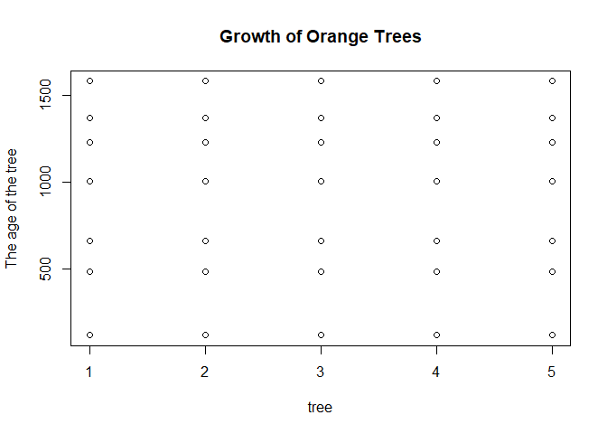

<!-- README.md is generated from README.Rmd. Please edit that file -->

# The dataset R Package <a href='https://dataset.dataobservatory.eu/'></a>

<!-- badges: start -->

[](https://github.com/dataobservatory-eu/dataset/actions/workflows/rhub.yaml)
[](https://lifecycle.r-lib.org/articles/stages.html#experimental)
[](https://www.repostatus.org/#wip)
[](https://cran.r-project.org/package=dataset)
[](https://cran.r-project.org/package=dataset)
[](https://github.com/ropensci/software-review/issues/553)
[](https://zenodo.org/record/6950435#.YukDAXZBzIU)
[](https://github.com/dataobservatory-eu/dataset)
[](https://dataobservatory.eu/)
[](https://app.codecov.io/gh/dataobservatory-eu/dataset)

<!-- badges: end -->

The aim of the *dataset* package is to make tidy datasets easier to
release, exchange and reuse. It organizes and formats data frame R
objects into well-referenced, well-described, interoperable datasets
into release and reuse ready form.

It enhances R’s data frames (`data.frame`, `tibble`) by allowing you to
attach machine-readable metadata to datasets and variables using R’s
native `attributes()`. This includes units, labels, definitions,
provenance, and persistent identifiers. This help making datasets *FAIR*
— Findable, Accessible, Interoperable, and Reusable — with embedding
semantics from the start.

## 🔧 Installation

You can install the latest CRAN release with
`install.packages("dataset")`.

``` r
install.packages("dataset")
```

The latest development version of dataset can be installed with
`remotes::install_github()`:

``` r
install.packages("pak")
pak::pak("dataobservatory-eu/dataset")
```

## 📦 Package Status

This package is under active development and currently under review by
rOpenSci:

- [Original submission
  (#553)](https://github.com/ropensci/software-review/issues/553) —
  including datacube scope
- [Resubmission
  (#681)](https://github.com/ropensci/software-review/issues/681) —
  focuses on core `dataset_df` and moves SDMX into downstream `datacube`

## 🚀 Quick Start: Semantically Rich Data Frames

``` r
library(dataset)
data("orange_df")

# A richly annotated dataset
orange_df
#> Draper N, Smith H (1998). "Growth of Orange Trees."
#>    rowid      tree       age        circumference 
#>                          The age of circumference 
#>    <hvn_lbl_> <hvn_lbl_> <hvn_lbl_> <hvn_lbl_>   
#>  1 orange:1   2 [1]       118        30          
#>  2 orange:2   2 [1]       484        58          
#>  3 orange:3   2 [1]       664        87          
#>  4 orange:4   2 [1]      1004       115          
#>  5 orange:5   2 [1]      1231       120          
#>  6 orange:6   2 [1]      1372       142          
#>  7 orange:7   2 [1]      1582       145          
#>  8 orange:8   4 [2]       118        33          
#>  9 orange:9   4 [2]       484        69          
#> 10 orange:10  4 [2]       664       111          
#> # ℹ 25 more rows
summary(orange_df)
#> Draper N, Smith H (1998). "Growth of Orange Trees."
#> The age of the tree (days since 1968/12/31)
#> circumference at breast height (milimeter)
#>     rowid                tree        age         circumference  
#>  Length:35          Min.   :1   Min.   : 118.0   Min.   : 30.0  
#>  Class :character   1st Qu.:2   1st Qu.: 484.0   1st Qu.: 65.5  
#>  Mode  :character   Median :3   Median :1004.0   Median :115.0  
#>                     Mean   :3   Mean   : 922.1   Mean   :115.9  
#>                     3rd Qu.:4   3rd Qu.:1372.0   3rd Qu.:161.5  
#>                     Max.   :5   Max.   :1582.0   Max.   :214.0
var_unit(orange_df$circumference)
#> [1] "milimeter"

# See dataset-level citation
print(get_bibentry(orange_df), "BibTeX")
#> @Misc{,
#>   title = {Growth of Orange Trees},
#>   author = {N.R. Draper and H Smith},
#>   year = {1998},
#>   identifier = {https://doi.org/10.5281/zenodo.14917851},
#>   publisher = {Wiley},
#>   contributor = {Antal Daniel [dtm]},
#>   date = {1998},
#>   language = {en},
#>   relation = {:unas},
#>   format = {:unas},
#>   rights = {:tba},
#>   description = {The Orange data frame has 35 rows and 3 columns of records of the growth of orange trees.},
#>   type = {DCMITYPE:Dataset},
#>   datasource = {https://isbnsearch.org/isbn/9780471170822},
#>   coverage = {:unas},
#> }

# Check recorded provenance (experimental)
provenance(orange_df)
#> [1] "<http://example.com/dataset_prov.nt> <http://www.w3.org/1999/02/22-rdf-syntax-ns#type> <http://www.w3.org/ns/prov#Bundle> ."                  
#> [2] "<http://example.com/dataset#> <http://www.w3.org/1999/02/22-rdf-syntax-ns#type> <http://www.w3.org/ns/prov#Entity> ."                         
#> [3] "<http://example.com/dataset#> <http://www.w3.org/1999/02/22-rdf-syntax-ns#type> <http://purl.org/linked-data/cube#DataSet> ."                 
#> [4] "<http://viaf.org/viaf/84585260> <http://www.w3.org/1999/02/22-rdf-syntax-ns#type> <http://www.w3.org/ns/prov#Agent> ."                        
#> [5] "\"_:smithh\" <http://www.w3.org/1999/02/22-rdf-syntax-ns#type> <http://www.w3.org/ns/prov#Agent> ."                                           
#> [6] "<https://doi.org/10.32614/CRAN.package.dataset> <http://www.w3.org/1999/02/22-rdf-syntax-ns#type> <http://www.w3.org/ns/prov#SoftwareAgent> ."
#> [7] "<http://example.com/creation> <http://www.w3.org/1999/02/22-rdf-syntax-ns#type> <http://www.w3.org/ns/prov#Activity> ."                       
#> [8] "<http://example.com/creation> <http://www.w3.org/ns/prov#generatedAtTime> \"2025-02-24T16:23:08Z\"^^<xs:dateTime> ."
```

Print title and labels:

``` r
plot(orange_df)
```



You can still use the object like a normal data frame or tibble — but
now it contains metadata that improves reusability, documentation, and
publishing.

## 💡 Why `dataset`?

### The Problem

Tidy data is powerful — but lacks semantics:

- What does `CPI` mean? Consumer Price Index or Corruption Perceptions
  Index?
- What does `GDP` represent? In euros? In dollars? Over what time
  period?
- What does a row *mean*?

This metadata is often detached, hidden in comments or README files, or
lost when saving to CSV. The `dataset` package keeps metadata *with the
data*, inside your `.Rds` or `.Rdata`.

## 🧩 What It Adds

- Variable-level metadata: `defined()` extends vectors with labels,
  units, and definitions.
- Dataset-level metadata: `dataset_df()` adds Dublin Core /
  DataCite-style bibentries.
- Provenance: Capture who modified the dataset and how (based on W3C
  PROV-O).
- Global row IDs: Assign meaningful URIs to rows using namespaces.

## 📖 Vignettes

- [Create datasets that are easier to share, exchange, and
  extend](https://dataobservatory-eu.github.io/dataset/articles/Motivation.html)
- [From R to RDF: Exporting datasets with
  `rdflib`](https://dataobservatory-eu.github.io/dataset/articles/rdf.html)
- [Bibentry for FAIR
  datasets](https://dataobservatory-eu.github.io/dataset/articles/bibentry.html)

## 🛠️ Releasing and Reusing Datasets

`dataset` supports both **data publishers** and **data consumers**:

- Data publishers can annotate datasets in-place, export to RDF or CSV,
  and publish with full metadata.
- Data consumers can inspect units, labels, definitions, and provenance
  before analysis — all within R.

For example:

``` r
gdp_1 <- defined(
  c(3897, 7365),
  label = "Gross Domestic Product",
  unit = "million dollars",
  definition = "http://data.europa.eu/83i/aa/GDP"
)

summary(gdp_1)
#> Gross Domestic Product (million dollars)
#>    Min. 1st Qu.  Median    Mean 3rd Qu.    Max. 
#>    3897    4764    5631    5631    6498    7365
attributes(gdp_1)
#> $label
#> [1] "Gross Domestic Product"
#> 
#> $class
#> [1] "haven_labelled_defined" "haven_labelled"         "vctrs_vctr"            
#> [4] "double"                
#> 
#> $unit
#> [1] "million dollars"
#> 
#> $definition
#> [1] "http://data.europa.eu/83i/aa/GDP"
```

## 🌍 Interoperability and Standards

- Based on **Dublin Core** and **DataCite** metadata models.
- Extends `haven_labelled` class (from the tidyverse) with units,
  definitions, and namespaces.
- Compatible with:
  - [`rdflib`](https://cran.r-project.org/package=rdflib) — for RDF
    export
  - [`dataspice`](https://docs.ropensci.org/dataspice/) — for search
    engine–friendly metadata
  - [`wbdataset`](https://wbdataset.dataobservatory.eu) — for publishing
    to Wikidata
  - [`frictionless`](https://frictionlessdata.io) — future integration

## 🧬 Example: Recording Artists from Small Countries

``` r
small_country_musicians <- dataset_df(
  qid = c("Q275912", "Q116196078"),
  artist_name = defined(
    c("Marta Roure", "wavvyboi"),
    definition = "https://www.wikidata.org/wiki/Property:P2093"
  ),
  location = defined(
    c("Andorra", "Lichtenstein"),
    definition = "https://www.wikidata.org/wiki/Property:P276"
  ),
  date_of_birth = defined(
    c(as.Date("1981-01-16"), as.Date("1998-04-28")),
    definition = "https://www.wikidata.org/wiki/Property:P569"
  )
)
```

## 📐 Design Goals

- Make metadata **non-intrusive**
- Stay within **base R and tidyverse**
- Be **compatible** with other tools — not replace them
- Offer **pragmatic defaults** for complex metadata

We are currently developing: - `datacube`: SDMX-like data model
support - `wbdataset`: Integration with Wikibase/Wikidata - Better
provenance support and graph metadata

## 🧪 Contributing

We welcome contributions and discussion!

- Please see our [CONTRIBUTING.md](CONTRIBUTING.md) guide.
- Ideas, bug reports, and feedback are welcome via [GitHub
  issues](https://github.com/dataobservatory-eu/dataset/issues).

## 📜 Code of Conduct

This project adheres to the [rOpenSci Code of
Conduct](https://ropensci.org/code-of-conduct/). By participating, you
are expected to uphold these guidelines.
